# 目标检测算法

根据目标检测原理大致可以先根据**两阶段**和**单阶段**划分，两阶段一般精度较高但计算量较大pipline更复杂所以速度更慢，单阶段模型pipline简单优雅，但精度一般稍逊一筹，随着object detection发展，单阶段模型精度已经慢慢达到甚至超越双阶段的baseline。后期又发展出`anchor-base`和`anchor-free`（主要是单阶段，孤陋寡闻没听说双阶段有anchor-free的）的算法。近期由于`transformer`的跨界，也有很多更强的新模型出现，在cv界大杀四方，靠暴力的参数量疯狂屠榜（半开玩笑，误！），由于工作主要还是对落地有较高要求（主要是性价比），本人暂无详细研究（2019年底我又回归OCR大业，主要搞回文本检测，文本识别，轻量化网络等方面的东西去了，所以后面百花齐放的通用目标检测算法也只有纸上谈兵了），等待后续钻研。

## 两阶段与单阶段大致区别

字面意思，两阶段是将目标检测分为两大部分，简单来说第一阶段是基于分类思想，先把前景和目标分离开，第二阶段再精调目标框。单阶段是一步到位，基本上就是以回归的思想直接把目标检测的活一次干完，两者的算法理念不同，各有优缺点。随着时间发展，两阶段的成本问题以及单阶段的性能不断提升，工业场景基本上都是单阶段目标检测模型落地了（据我所知）。

## 两阶段

* 发展大致从RCNN -> fast RCNN -> faster RCNN -> Cascade RCNN
* 由于RCNN和fast-RCNN现在基本上没人用了，就简单介绍一下，faster-rcnn及其后续的mask-rcnn和cascade-rcnn才是工业界用到的成熟算法模型，而且由于单阶段模型的百花齐放，现在也罕见（个人所见 也许是以偏概全了😂）工业场景用两阶段目标检测落地了（主要是成本控制和效率问题，mask-rcnn做实例分割还是见过几家在用的，现在有没有在用就不晓得了）

### RCNN

* 原理&pipline
  * 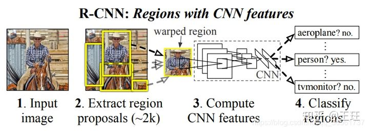
  * 图解中第二步：首先通过selective search从输入图像中得到2k个预选框，由于该方法过于古老，目前已经没有任何优势，贴一个很棒的算法简介[selective search](https://zhuanlan.zhihu.com/p/39927488)我就不多赘述了。
  * 图解中的warped region：就是把通过selective search得到的2k个框内图像resize到同一个尺寸
  * 图解第三步：把resize后到图像扔到CNN里，将CNN最后pool层的特征保存下来
  * 第四步： 用SVM对第三步抽的feature进行分类和回归；正样本与Ground Truth的IoU>0.5，最大IoU；负样本IoU<0.3，这里是训练多个二分类的SVM分类器
  * bbox的回归：训练一个具有校正因子的线性回归分类器(FC)，损失函数是L2损失。 回归分类器预测的是Ground Truth相对于`预选框`的中心点、长宽的偏差，其中G表示Ground Truth，P表示预选框(Proposal)。中心点使用相对坐标便于优化(区间在0~1)，并且可以很好的应对不同尺度的目标、图像大小；长宽用log，是因为G=P exp(dP)，反过来就是log了。
  * 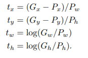
  * 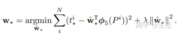

* 贡献&亮点
  * selective search
  * 早期使用CNN做目标检测有比较好效果的算法模型，也是奠定了RCNN系列两阶段目标检测模型的开山之作。膜拜RGB大神和凯明大神！
* 不足
  * 不能e2e的训练，训练很繁琐，由于是早期模型，速度和精度都很低，记得很早之前试过要分钟级别的evaluate才能出结果。。。
  

### fast-RCNN

* 原理&pipline
  * 在RCNN基础上改进，只需要对整幅图像（而不是对每个bbox内的小图）进行一次特征提取，并且直接利用FC进行分类和回归，实现end-to-end两阶段目标检测。
  * 具体过程：
    * 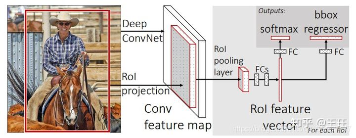
    * 1.图像先经过Backbone网络提取图像的feature map
    * 2.利用selective search搜索的预选框到特征上提取RoI的特征
    * 3.通过RoI Pooling将RoI的特征转化为固定的大小
    * 4.最后输入到分类和回归头分别进行分类和回归
* 贡献&亮点
  * Roi pooling
    * RoI Pooling的有两个输入，一个是feature map，即整个图像经过Backbone提取的特征；另一个是RoI的坐标5维，[idx，x1，y1，x2，y2]表示左上角和右下角的坐标。坐标尺度是相对原图的尺度，而在feature上根据图像下采样的比例(即feature/原图尺度)找到对应的坐标。
    * 将映射后的区域划分为相同大小的区间(比如7×7)，这样就可以从不同大小的RoI中获得固定大小的feature map，最终输出[H,W,C]维度的特征图，C表示通道个数，然后进行分类和回归处理。 值得注意的是： 当proposal在特征图上的尺度大于7×7时(比如RoI Pooling输出的是7×7)，比较好理解，直接计算特征图到7×7映射的每个bin的最大值；当proposal小于7×7咋办呢？其实还是一样的，仍然这样强行处理，只不过会有一部分值是重复的。在Mask RCNN中对RoI Pooling进行了修改，采用线性插值的方式来做的，也就是roi align，工业场景有直接用roi align替换roi pooling使faster-rcnn更准。
    * 损失函数 损失函数分为分类和回归损失函数，与RCNN不同的是这里直接用FC进行分类和回归，分类损失函数Cross Entropy和Smooth L1。 分类共有N+1类，+1表示背景类； 回归用Smooth L1损失，对[x，y，w，h]进行回归，其中回归的约束目标仍然是中心点和长宽的相对值，与RCNN相似。Smooth L1损失：
    * 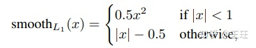
  * 整个过程e2e
* 不足
  * 候选框仍基于selective search，尽管比RCNN快点，但还是很慢
* 源码
  * 推荐[mmdetection实现](https://github.com/open-mmlab/mmdetection)

### faster-RCNN

* 原理&pipline
  * Faster RCNN在Fast RCNN的基础上提出RPN(Region Proposal Network)自动生成RoI，极大的提高了预选框生成的效率，取代selective search，之后还是fast-rcnn
* 贡献&亮点
  * anchor-based
    * 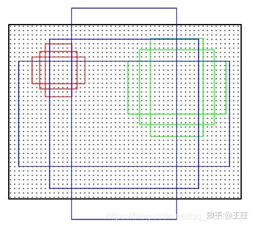
    * 提出了在feature map上画密集anchor的方式生成规则候选框，是很暴力，但是效果也很好
    * 在这里，以feature map的每一个点为中心，以不同长宽比(1:1, 1:2, 2:1)，缩放比(8, 16, 32倍)为规则生成anchor box，如果应用在类似OCR这种长宽比比较奇葩的场景，可以根据具体场景gt bbox的分布适当修改这两个参数，以生成更适合的anchor。
  * RPN
    * 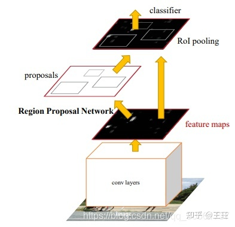
    * RPN网络输入是feature map，输出是RoI及分类结果,此时只做背景和目标二分类
    * RPN网络计算所有生成的`RoI与anchor的偏差`和`是否为object的分类`结果
    * 对`是否为object分类`结果进行分数排序，获得前N个预选框，记得paper里是`2k`个？
    * 对超出边界的bbox进行越界处理
    * 对候选框们进行`NMS`去重，这里简单说一下`NMS`：大致就是对所有框`IOU`大于阈值的进行去重处理，`IOU`和`NMS`这种算子会在末尾说明。
    * 最后将RPN网络预测的RoI送入到RoI Pooling中进行特征提取，此特征与输入RPN网络的特征图是同一个，后续接分类头和回归头，`简单来说faster-rcnn基本上就是用RPN代替selective search的fast-rcnn，也就等同于RPN+fast-rcnn`
* 源码
  * 推荐[mmdetection实现](https://github.com/open-mmlab/mmdetection)

### Cascade-RCNN

* 原理&pipline
  * Faster RCNN进行改进的版本, 由于faster-rcnn训练时知道Ground Truth（GT），可以直接筛选高质量的Proposal用于最后的分类和回归，但是在测试阶段，我们并不知道GT，导致所有的Proposal都进行最后的分类和定位，这就是训练和测试阶段的不匹配问题，所以提出使用集联的多个检测头，每个检测头的IoU呈现递增的情况，比如0.5、0.6、0.7。低级检测头采用低IoU阈值可以提高召回率，避免目标丢失；后续的高级检测头在前一阶段的基础之上提高阈值可以提高检测精度。这种方法可以在增加不太多参数量的基础上提升检测器的精度（反正都很慢了，如果用于工业场景也是对速度没啥要求，对精度有很高要求的情况，所以再慢点也可以接受吧。。。）
  * 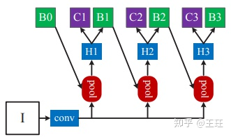
* 贡献&亮点
  * cascade多个检测头，提升mAP
* 源码
  * 推荐[mmdetection实现](https://github.com/open-mmlab/mmdetection)

## 单阶段

发展大致从YOLO v1 -> SSD -> YOLO v2 -> YOLO v3 -> RetinaNet -> FCOS -> CenterNet -> YOLO v4，v5，YOLOF，YOLOR，YOLOX，YOLOE等各种花式YOLO变体（大部分还是叠加工程trick，算法大改进没感觉有啥）以及基于transformer（应该算是单阶段？）等。

### YOLO v1

* 原理&pipline
  * 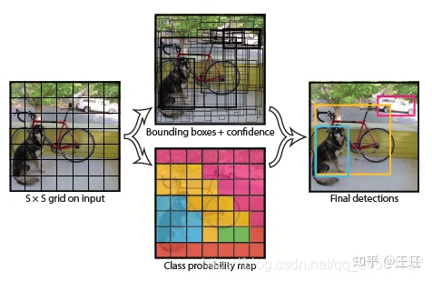
  * 不同于RCNN系列，YOLO将目标检测看作一个回归任务，一张图送到backbone中抽feature，把图resize成一个正方形（448x448）进去，输出7x7x(2x5+n)的output，其中7x7指的是最后feature map layer size，也就是说backbone最后把整张图分成7x7的网格，2x5里面的`2`是指每个网格内有两个物体，`5`分别代表这个物体bbox的`x`,`y`,`w`,`h`,和`confidence`，`n`就是object的类别数，所以说原理非常的简单粗暴，但是又很“有效”。那为啥就有效呢？这个得详细说说YOLO的loss function。可以说单阶段的这种相对“简单”的目标检测算法其实是大道至简，如何设计目标检测的编码模式和性能权衡，基本上就是看loss function的设计了。
  * 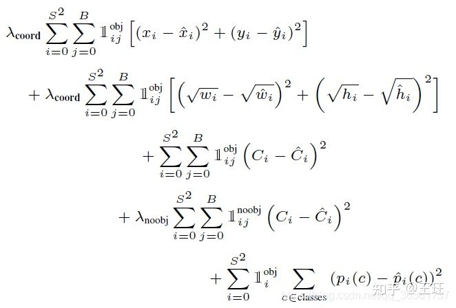
  * 先说说bbox的编码方式吧，我在复现YOLO v1的时候也参考了原作者和其他大牛的实现（[详见个人学习娱乐版实现](https://github.com/haoran1062/YOLO_V1) 当时心血来潮就写了一下，年久失修了只是学习使用，性能挺呵呵的。。。），然后决定把该算法的核心实现分为[backbone](https://github.com/haoran1062/YOLO_V1/tree/f0fcb05749312b4e42a16d798e3bd8e1e56d80e5/backbones),[encoder](https://github.com/haoran1062/YOLO_V1/blob/master/utils/YOLODataLoader.py#L200),[decoder](https://github.com/haoran1062/YOLO_V1/blob/f0fcb05749312b4e42a16d798e3bd8e1e56d80e5/utils/utils.py#L94),[loss function](https://github.com/haoran1062/YOLO_V1/blob/f0fcb05749312b4e42a16d798e3bd8e1e56d80e5/v1Loss.py)这几个大步骤，其中的[encoder](https://github.com/haoran1062/YOLO_V1/blob/master/utils/YOLODataLoader.py#L200)和[decoder](https://github.com/haoran1062/YOLO_V1/blob/f0fcb05749312b4e42a16d798e3bd8e1e56d80e5/utils/utils.py#L94)的作用就是分别是把**gt**`编码`成YOLO的label输入格式和把最终网络输出的**pred**`解码`还原回图中bbox的位置。
  * encoder方式大概说一下：我们先随便找一个图片(`假设image size = iw, ih`)gt中的bbox，一般voc格式或者其他目标检测输入的框是由`左上角(x1, y1)`和`右下角(x2, y2)`两个点组成的，且这两个点一般是`未归一化`的原始坐标，首先我们要先把x1, y1, x2, y2这种左上角和右下角的标注方式改成以`当前bbox中心点(cx, cy)`，`bbox的宽w高h`的四个值表示，即(x1, y1, x2, y2) -> (cx, cy, w, h), 再将坐标转换为归一化坐标，就是根据图片本身的长宽把原来变成0~1.0之间，也就是用([[cx, w], [cy, h]) 分别除以对应的 iw 和 ih 变成相对图片长宽归一化后的值，这还没完事，再根据划分的网格数量（比如原始paper中划分为7x7的网格）求得当前cx,cy属于哪个cell中，再根据当前cell的中心点和当前这个bbox的(cx, cy)相减得到偏移量(dx, dy),这就是当前bbox和落到这个网格cell中心点之间的偏移量了。
    * 也就是说，上面说的`x`,`y`,`w`,`h`,`confidence`中，`x`, `y`实际上是当前bbox中心点相对于落在负责检测出该物体的网格cell中心点的偏移量，网络需要学习的是这个偏移量，`w`和`h`则是直接很暴力的回归这个bbox应该的大小了，也是因为bbox回归的过于简单粗暴，导致YOLOv1预测出的bbox实际上大小并不准😂
    * 而`confidence`其实是预测了当前这个cell上有没有物体的置信度，这就相当于RCNN的第一阶段做的事了，也就是区分前后背景，而RCNN第二阶段的bbox微调在YOLO这种单阶段算法里是没有了，直接暴力回归`w`和`h`，RCNN第二阶段的分类任务也包含在了YOLO这个(2x5+n)后面这个长度为n的tensor段里面，这n就是相当于分类的onehot，当然你可以用多标签分类输出最后取max，也可以选择用softmax直接当单类别输出，这个输出的概率其实才是`当前这个cell包含的物体的真正类别置信度`
    * ps：我实现的时候这个(2x5+n)的tensor是这么定义的：前10位是两个一模一样的(x, y, w, h, conf)，其实作者这么做应该是为了小幅提高recall，万一一个cell的confidence没达到阈值，另一个达到了阈值，那也是可以输出bbox的，但是我实际试了一下，一个cell里面只有1个(x, y, w, h, conf)和多几个效果真啥差别。。。
    * 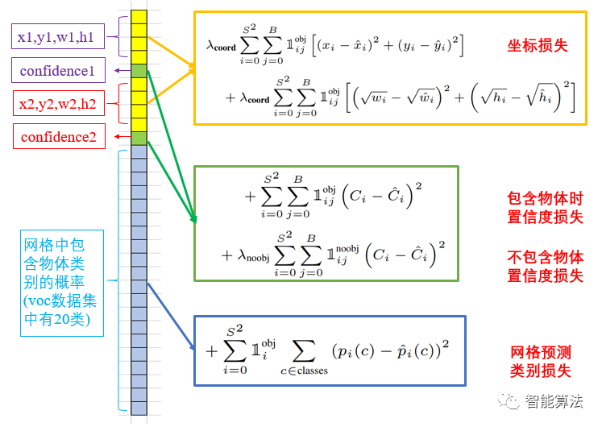

* 贡献&亮点
  * YOLOv1可以说是第一个“能打”的单阶段目标检测算法，也可以说是（工业可用）单阶段目标检测算法的开山之作
  * 原理简洁明了，基本上就是backbone后面接一个FC输出，最关键的就是loss function的设计，做到极为简洁的单阶段目标检测框架，通过看一次全局的图片就可以得到结果，配得上you only look once的称号。
  * 以现在来看，YOLO v1还有一个不可思议的一点就是它是`anchor free`的！这在当时是很超前的（当然准确率一般，因为早期loss function设计的比较简单粗暴，这也是为什么后续版本又参考faster-rcnn把anchor机制简化后加上了。。。），可以说YOLO作者这个少女心十足的大胡子真的很厉害很超前，绝对是一个值得膜拜的大神😂
* 不足
  * 速度虽然比faster-rcnn这种重量级两阶段模型快很多，但是精度实在拉垮，记得当时用YOLO v1的时候，小目标和重叠目标死活出不来（即使是训练集也训不出来），原因就是上面提到的编解码和loss function设计问题导致的了
  * 这里详细说明一下编解码和loss function设计的问题，会导致天生不能对密集场景做检测以及小目标和重叠问题：这里我们假设一个output tensor定义为SxSx(B*5+N),其中SxS就是cell的个数，B就是每个cell编码中的instance个数, N是数据集中object的类别数，因为像paper里面的参数去设置7x7(S=7)的cell，每个cell里面只可能出现2(B=2)个instance，由于编码设计问题，每个cell其实只能有效对应一个object的类别，从代码里看循环加载gt的时候同一个cell出现的object编码信息会被后面出现的编码信息所覆盖，当然有人觉得可以做个判断去优化一下啦，然并卵哦，因为后面的n是固定的，所以一个cell只能输出一个类别，也就只能有一个instance输出，而B多一些其实也就期待recall能高点，万一出来的confidence更高的框w和h能回归更准点。所以说，理论上最多可以检测SxS个instance，B多了也没啥用，想用YOLO v1检测出更多的instance，是要扩大S才行的～
* 源码
  * [官方实现](https://github.com/pjreddie/darknet)更新的太多我已经找不到yolov1的源码了。。。可能要靠大家自己找找了，ps：作者是用C写的，还是参考我实现的吧（开个玩笑）
  * [个人学习娱乐版实现](https://github.com/haoran1062/YOLO_V1)

### YOLO v2

* 原理&pipline
* 贡献&亮点
* 源码

### YOLO v3

* 原理&pipline
* 贡献&亮点
* 源码

### SSD

* 原理&pipline
* 贡献&亮点
* 源码

### RetinaNet

* 原理&pipline
* 贡献&亮点
* 源码

### FCOS

* 原理&pipline
* 贡献&亮点
* 源码

### CenterNet

* 原理&pipline
* 贡献&亮点
* 源码

### YOLO v4

* 原理&pipline
* 贡献&亮点
* 源码

### YOLO v5

* 原理&pipline
* 贡献&亮点
* 源码

### YOLOF

* 原理&pipline
* 贡献&亮点
* 源码

### YOLOR

* 原理&pipline
* 贡献&亮点
* 源码

### YOLOX

* 原理&pipline
* 贡献&亮点
* 源码

### YOLOE

* 原理&pipline
* 贡献&亮点
  * baidu集各种工程trick的集大成之作，可以说是工业上拿来即用的神器了
* 源码

## Transformer
### 待学习待研究。。。

## 目标检测通用算子和架构
* NMS及其变种
* FPN

## 参考文章
* [单阶段、两阶段目标检测经典算法(RCNN系列、YOLO系列、SSD、RetinaNet等)大汇总](https://zhuanlan.zhihu.com/p/367069340)